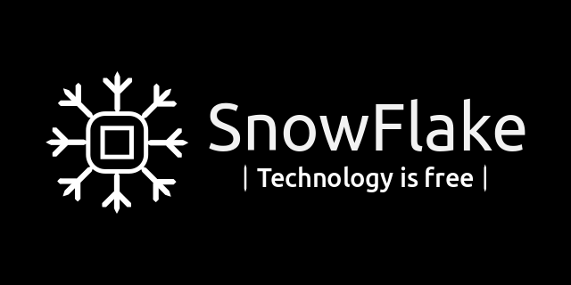

# 

[![BSD-3-Clause][s1]][li]

[s1]: https://img.shields.io/badge/License-BSD%203--Clause-blue.svg

[li]: LICENSE

Technology is free, SnowFlakeOS

## Library used
- utf16_literal (https://github.com/thepowersgang/rust_os/tree/master/Bootloaders/libuefi/utf16_literal)
- uefi (forked, https://github.com/thepowersgang/rust_os/tree/master/Bootloaders/libuefi)
- slab_allocator (https://github.com/redox-os/slab_allocator)

## TODO
### Boot2Snow (x86_64, UEFI)
- [x] Add uefi_alloc support
- [x] Load kernel from disk
- [ ] Basical UI
- [ ] Enable boot timeout
### SnowKernel
- [x] Kernel heap
- [ ] IDT
- [ ] Better GUI library support
- [ ] Add modular support
- [ ] Multitasking support
- [ ] Write init process
#### Kernel Modules
- [ ] Drivers
- [ ] IPC
- [ ] System calls
- [ ] File system
- [ ] VFS

## Building
Requirements to build
- Rust (https://www.rust-lang.org)

### Windows
#### Windows 10 or later
Starting with Windows 10, you can use Ubuntu Bash. You can run it by typing C:\Windows\System32\bash.exe. For more information, please visit https://www.howtogeek.com/249966/how-to-install-and-use-the-linux-bash-shell-on-windows-10/

You need to install Rust, qemu, mtools on Ubuntu Bash. You can install Rust using the following command.
```
$ curl https://sh.rustup.rs -sSf | sh
$ sudo apt install qemu
$ sudo apt install mtools
```
This script will download and install the rustup-init executable for your current platform.

After the installation is complete, you should clone the SnowFlake repository.
```
$ git clone https://github.com/SnowFlake/SnowFlake.git
```
To build SnowFlake as an x86_64 target, x86_64-elf cross-compilation is required. If you do not have the x86_64-elf compiler, and your system is x86_64, you can use the 'x86_64-linux_env.sh' script. And you should add rustup component.
```
$ cd SnowFlake
$ sh x86_64-linux_env.sh
$ cd kernel
$ rustup component add rust-src
$ cd ./../
$ make run
```

#### Windows 8.1 or lower
Will be added later

### Mac
Will be added later

### Linux
To build SnowFlake as an x86_64 target, x86_64-elf cross-compilation is required.
If you do not have the x86_64-elf compiler, and your system is x86_64, you can use the 'x86_64-linux_env.sh' script.
```
$ sh x86_64-linux_env.sh
```
#### Arch Linux
```
$ pacman -S qemu mtools
$ git clone https://github.com/SnowFlake/SnowFlake.git
$ cd SnowWhite
$ make run
```

## Reference
- https://github.com/phil-opp/blog_os (MIT OR Apache 2.0 License)
- https://github.com/thepowersgang/rust_os (2-clause BSD licence)
- https://github.com/redox-os/orbclient (MIT License)
- https://github.com/redox-os/uefi (MIT License)
- https://github.com/system76/firmware-update
